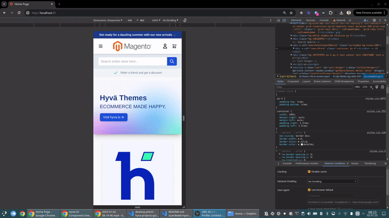

### Improved Hyva UI Header (C) + Menu (B)

This is boilerplate code for Hyva UI component (header-c + menu-b), which includes:

- Animation for menu opening mobile/desktop
- Header sticky position
- Support of Scandiweb Menu manager

### FAQ

    
<strong>How to set Scandiweb Menu organizer?</strong>

    

    By default this solution uses default Magento navigation. To enable Scandiweb Menu organizer, it is required to replace code in both <code>desktop.phtml</code> and <code>mobile.phtml</code> files:
    

    <pre>
    /** @var Navigation $viewModelNavigation */
    $viewModelNavigation = $viewModels->require(Navigation::class, $block);
    $menuItems = $viewModelNavigation->getNavigation(4);
    $block->setData('cache_tags', $viewModelNavigation->getIdentities());</pre>
    with:
    <pre>
    /** @var MenuManager $viewModelMenuManager */
    $viewModelMenuManager = $viewModels->require(MenuManager::class);
    $menuItems = $viewModelMenuManager->getMenuItems('menu');
    $block->setData('cache_tags', $viewModelMenuManager->getIdentities());</pre>
    Note: <code>menu</code> is indentifier of menu which will be used. Currently support for configuration of setting menu is not made.

### How it looks

