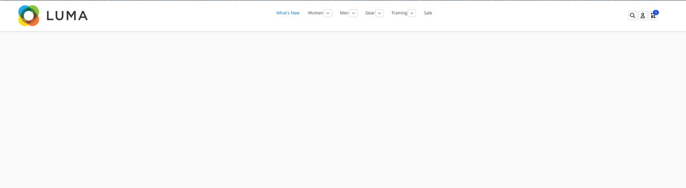
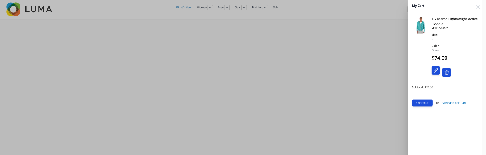

# Hyva header sharing to luma theme

## Setup

- Move `app/code` to your Vendor/Theme module, where "Vendor" is your project name.
- Move `app/design` themes to your corresponding one on project.

## How to work with it

- In `app/design/Vendor/Hyva/web/tailwind` run command `npm run watch` to works with styling locally. It will create 2 jobs are same time to compile styles to both themes.
- For production build run as usual `npm run build` in same folder. It will compile styles for Hyva theme and copy it to Luma.

## Note

Since it is boilerplain code, your paths can be not the same, therefor recheck in `app/design/Vendor/Hyva/web/tailwind/package.json` scripts of run and build to insure paths to Luma theme are set correctly.

Styles might break on Luma, it is due to conflicting tailwind styles with default luma one. This requires manual fixes.

## Result

In result you should 1 consistent header on both themes with its functionality from Hyva.

## 

