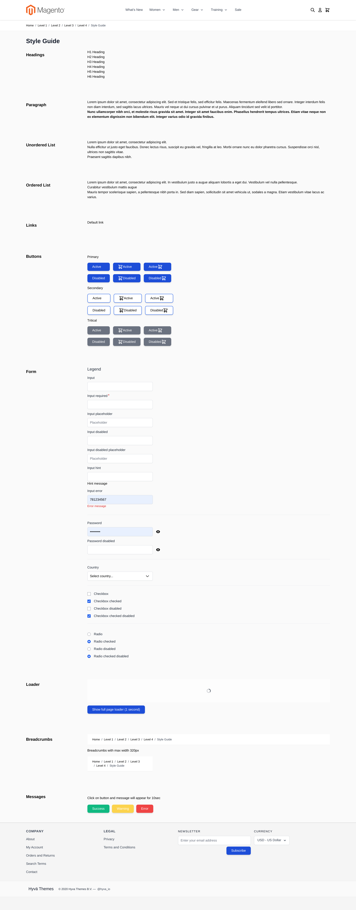

# Hyva style guide page

This page is purposed for easier Base Template (BT) styling.

## How it works

Module `Scandiweb/StyleGuide` creates new route with url **style_guide**. Route contains basic elements from project with already defined classes, which should be styled.

There is no restrictments in adding new elements or adjustments to BT, just take in note, that already defined basic classes for elements (form-input, btn, btn-primary and etc) should not be changed.

After installing module, in result you should see:

